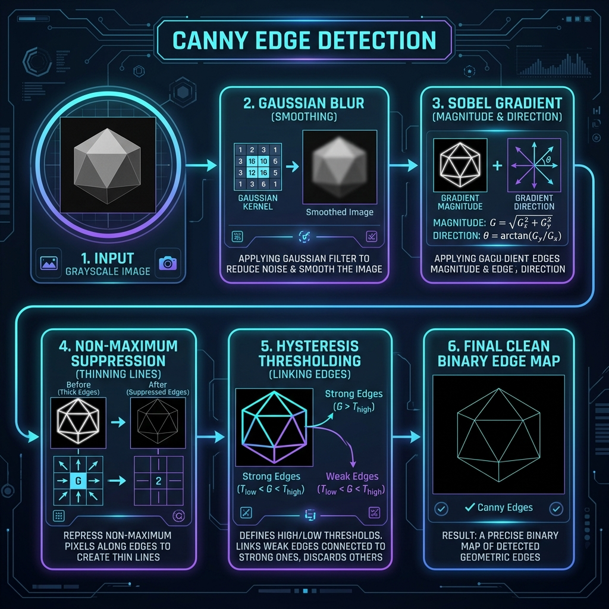

# Canny-Edge-Detection-on-RISC-V-Project

[](docs/html/index.html)



## Project Overview
This repository implements a modular Canny edge detection pipeline in C++ with an emphasis on RISC-V Vector (RVV) acceleration. The primary target is `rv64gcv` user-mode execution under `qemu-riscv64`, with native host validation via GoogleTest.

The workflow focuses on:
* A scalar baseline for algorithm correctness.
* RVV-enabled kernel implementations that are vector-length-agnostic.
* Cross-compilation of target binaries for RISC-V and host-side functional verification.

## Prerequisites
Required components:
* Linux or compatible POSIX environment.
* RISC-V GNU toolchain: `riscv64-unknown-elf-g++` built with `--with-arch=rv64gcv --with-abi=lp64d`.
* QEMU user-mode emulator: `qemu-riscv64`.
* GoogleTest installed and accessible via `$(HOME)/googletest-installed`.
* Doxygen 1.9.8 for documentation generation.

The setup scripts also install additional documentation and runtime dependencies including Doxygen GUI components, LaTeX support, Graphviz, Qt5 runtime libraries, and RISC-V cross compiler packaging.

Recommended packages for Ubuntu/Debian:
```bash
sudo apt install build-essential bison flex libssl-dev libz-dev python3 python3-venv python3-pip cmake doxygen doxygen-gui doxygen-latex doxygen-doc graphviz
```

## Repository setup

### Clone repository
```bash
git clone https://github.com/Youssif991/Canny-Edge-Detection-on-RISC-V-Project.git
cd Canny-Edge-Detection-on-RISC-V-Project
```

### Automated environment setup
The `toolchain-setup` scripts automate toolchain and emulator preparation:
```bash
chmod +x toolchain-setup/*.sh
./toolchain-setup/main.sh
```

This performs:
* `step1_prerequisites.sh`: installs host build dependencies.
* `step2_toolchain.sh`: builds a bare-metal RISC-V toolchain under `~/riscv-toolchain`.
* `step3_qemu.sh`: builds QEMU with user-mode support and plugin enablement.
* `step4_project.sh`: builds and installs GoogleTest under `~/googletest-installed`.
* `step5_python.sh`: configures `.venv` and installs Python analysis dependencies.

Reload your shell after setup:
```bash
source ~/.bashrc
```

## Build and test workflow

### Native host verification
Run the host-side GoogleTest suite:
```bash
make test
```
This compiles `tests/host_tests.cpp` and the pipeline implementation with the host compiler, then executes the resulting binary.

### RISC-V target build
Compile the full pipeline for RISC-V execution:
```bash
make canny_rv
```
Output:
* `build/target/release/canny_rv.elf`

### Run the RISC-V binary under QEMU
```bash
make run
```
Invokes QEMU with `-cpu rv64,v=true,vlen=256,elen=64`.

### Vector-length validation
```bash
make run_vlen
```
Executes the RISC-V binary across VLEN values `128`, `256`, and `512` to confirm RVV correctness independent of hardware vector length.

### Image I/O unit test
```bash
make image-io-test
```
Builds and runs the host-side image I/O regression test binary.

### Clean artifacts
```bash
make clean
```

## Directory structure

```text
.
├── assets/                 # Raw grayscale test images stored as `width * height` byte streams
├── build/                  # Generated build artifacts
│   ├── host/debug/         # Host-side test binaries
│   ├── target/debug/       # RISC-V debug binaries
│   └── target/release/     # RISC-V release binaries
├── docs/                   # Doxygen output directory
│   ├── html/               # Generated HTML documentation
│   └── latex/              # Generated LaTeX output
├── include/                # Public C++ headers for each pipeline stage
├── src/                    # Implementation source files
├── tests/                  # GoogleTest suites and stage tests
├── toolchain-setup/        # Setup scripts for toolchain and QEMU
├── tools/                  # Python helpers for test image generation and visualization
├── Doxyfile                # Doxygen configuration
├── Makefile                # Build and test automation
└── README.md               # Project documentation
```

> Raw `.raw` test assets are tracked in Git. Generated `.png` visualizations are ignored by `.gitignore`.

## Canny pipeline modules

| Stage | Files | Technical details |
| :--- | :--- | :--- |
| Image I/O | `include/image_io.hpp`, `src/image_io.cpp` | Raw grayscale I/O using aligned byte buffers and metadata structures; supports 64-byte alignment and size validation. |
| Gaussian blur | `include/gaussian.hpp`, `src/gaussian.cpp` | 5x5 separable convolution with scalar baseline. |
| Sobel gradient | `include/sobel.hpp`, `src/sobel.cpp` | Computes `G_x` and `G_y` using standard Sobel kernels. |
| Magnitude | `include/magnitude.hpp`, `src/magnitude.cpp` | Computes edge magnitude using both L1 (`|G_x| + |G_y|`) and L2 (`sqrt(G_x^2 + G_y^2)`) norms. |
| Direction | `include/direction.hpp`, `src/direction.cpp` | Quantizes gradient orientation into four discrete sectors for downstream NMS. |

## Technical Architecture & Design Decisions

### RAII Metadata & Memory Alignment
To facilitate high-performance execution on RISC-V targets and enable seamless auto-vectorization or explicit RVV (RISC-V Vector) intrinsic usage:
* **`image::io::metadata_t<PixelT>`**: A templated metadata struct that manages buffer ownership using RAII via `std::unique_ptr` with a custom deleter. 
* **64-Byte Alignment**: All memory allocations are padded and aligned to 64-byte boundaries (using `std::aligned_alloc` and `utils::memory::align_64`). This aligns image rows to cache lines and vector registers, preventing unaligned memory access penalties.

### Unified Pipeline Status Codes
Every stage of the pipeline returns a unified `Status` enumeration rather than plain booleans to support detailed diagnostic error reporting:
* `E_OK` — Operation succeeded.
* `E_NOK` — General failure.
* `E_ALLOC_FAIL` — Aligned memory allocation failed.
* `E_INVAL_PTR` — Null pointer passed to pipeline stage.
* `E_INVAL_DIR` — Asset path not found or invalid directory.
* `E_INVAL_SIZE` — Non-positive image width/height.
* `E_READ_FAIL` / `E_WRITE_FAIL` — File I/O mismatch or write error.

### Convolution Kernels & Arithmetic
The pipeline is designed with embedded constraints in mind:
* **Fixed-Point Integer Arithmetic**: The pipeline operates purely with integer arithmetic (no floating-point operations) to optimize execution on integer-only cores.
* **Gaussian Filtering**: Features both a 2D spatial convolution using a $5 \times 5$ kernel (with coefficients summing to `273`, scaled down by `273`) and a separable 1D convolution using a $1 \times 5$ kernel (`[1, 4, 7, 4, 1]`, summing to `17`).
* **Boundary Handling**: Image boundary pixels are processed using **zero-padding** (treating pixels outside the boundary as 0).

## Documentation

Code documentation is generated from inline Doxygen comments, configured with `docs/conf.py`, and styled with the modern, minimalist, and mobile-friendly **m.css** theme. HTML output is written to `docs/html`.

### Generate and View Documentation

To generate the HTML documentation:
```bash
make docs
```

To open the documentation in your browser:
* **Linux**:
  ```bash
  xdg-open docs/html/index.html
  ```
* **Windows (PowerShell)**:
  ```powershell
  Start-Process docs/html/index.html
  ```
* **macOS**:
  ```bash
  open docs/html/index.html
  ```

## Verification commands

* `make test` — host-side unit test execution.
* `make image-io-test` — image I/O regression test.
* `make canny_rv` — cross-compile RISC-V target binary.
* `make run` — execute the RISC-V binary in QEMU.
* `make run_vlen` — validate vector-length independence.

## Notes

* Target architecture: `rv64gcv`.
* Emulation: QEMU user-mode (`qemu-riscv64`).
* Host compiler uses `-std=c++17` and GoogleTest integration.
* `assets/*.raw` are commit-safe; generated `.png` files are ignored.

## Authors

* [@Youssif991](https://github.com/Youssif991)
* [@youssefteam18-boop](https://github.com/youssefteam18-boop)
* [@naderhany12](https://github.com/naderhany12)
* [@minawaeltanagho](https://github.com/minawaeltanagho)
